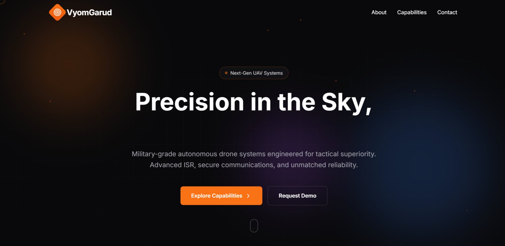
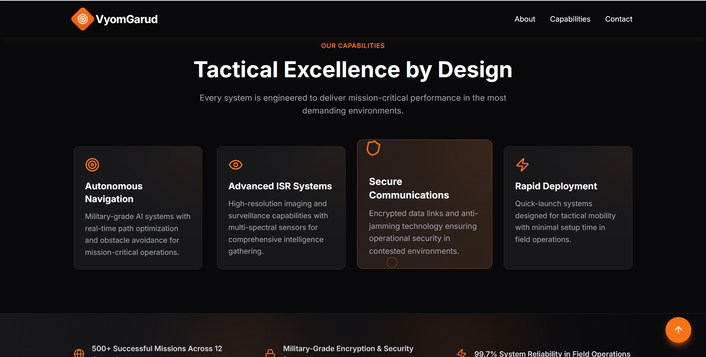

# VyomGarud UAV Systems Landing Page

A modern, responsive landing page for VyomGarud - a military-grade UAV/drone systems company. Built with React and Tailwind CSS, featuring a dark, futuristic aesthetic with smooth animations.

![VyomGarud Landing Page]

### ScreenShots




## 🚀 Live Demo

[View Live Demo](https://vyomgarud-landing-gold.vercel.app/)

## ✨ Features

- **Modern Design**: Dark theme with orange accent colors (#ff7b00)
- **Fully Responsive**: Optimized for mobile, tablet, and desktop
- **Smooth Animations**: Subtle animations and hover effects
- **Military Aesthetic**: Professional, precision-engineered design
- **Interactive Elements**: Animated hero section, capability cards, contact form

## 🛠️ Tech Stack

- **React 18**: Modern React with Hooks
- **Tailwind CSS**: Utility-first CSS framework
- **Lucide React**: Beautiful, consistent icons
- **Inter Font**: Clean, professional typography

## 📦 Installation

```bash
# Clone the repository
git clone https://github.com/Vaseemsworld/VyomGarud_Landing/

# Navigate to project directory
cd Vyomgarud-landing

# Install dependencies
npm install

# Start development server
npm start
```

The app will open at [http://localhost:3000](http://localhost:3000)

## 🏗️ Build for Production

```bash
npm run build
```

Creates an optimized production build in the `build` folder.

## 📂 Project Structure

```
vyomgarud-landing/
├── public/
├── src/
│   ├── App.js          # Main component with all sections
│   ├── index.js        # Entry point
│   └── index.css       # Global styles with Tailwind
├── package.json
├── tailwind.config.js
└── README.md
```

## 🎨 Design Notes

### Color Palette

- Background: `#09090b` (zinc-950)
- Secondary: `#18181b` (zinc-900)
- Accent: `#ff7b00` (orange-500)
- Text: White and zinc shades

### Sections

1. **Hero**: Animated background with CTAs
2. **About**: Company mission and statistics
3. **Capabilities**: 4 feature cards
4. **Highlights**: Key metrics and achievements
5. **Contact**: Interactive contact form
6. **Footer**: Links and company info

### Responsive Breakpoints

- Mobile: < 768px
- Tablet: 768px - 1024px
- Desktop: > 1024px

## 👨‍💻 Author

Created as part of a technical assessment for VyomGarud UAV Systems.

## 📄 License

This project is created for assessment purposes.
